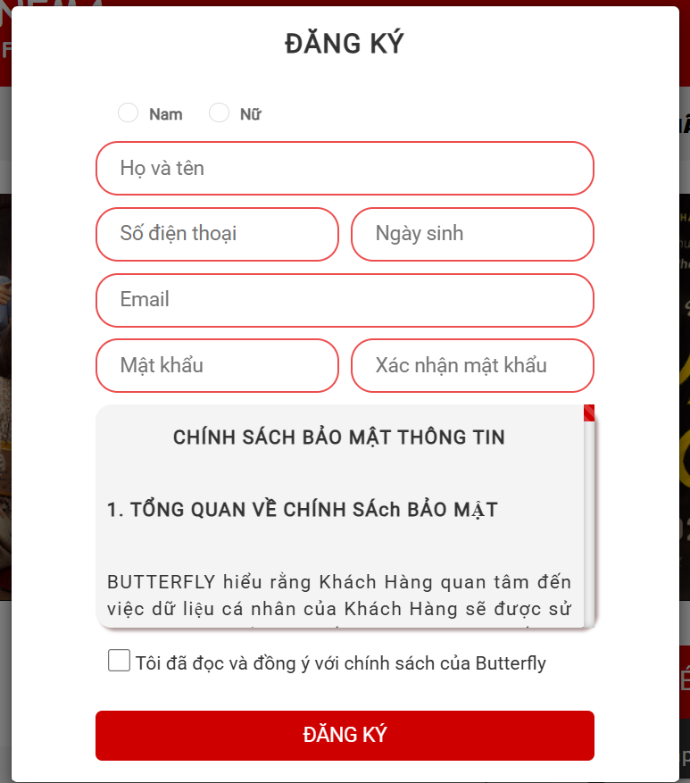

# 🎮 Butterfly Cinema - Cinema Management System

## 📋 Giới thiệu

**Butterfly Cinema** là hệ thống quản lý rạp chiếu phim hiện đại, xây dựng trên nền tảng **ASP.NET Core Razor Pages (.NET 6)** với cơ sở dữ liệu **PostgreSQL**.
Dự án hỗ trợ quản lý toàn diện các nghiệp vụ rạp chiếu phim như: rạp, phòng chiếu, ghế, phim, suất chiếu, vé, món ăn, combo, đặt vé, thanh toán, người dùng, nhân viên, phân quyền, quảng cáo...

---

## 🎬 Butterfly Cinema - Demo Screenshots

### 🏠 Home Page


### 🎟️ Booking Page


### 🛠️ Admin & Authentication




### 🎞️ Movie Details & Listing


### 📰 News & Information


### 💬 Contact Page


### 🎁 Discount Page


## 🚀 Tính năng nổi bật

* **Quản lý rạp (Cinema):** Thêm, sửa, xóa, xem danh sách rạp.
* **Phòng chiếu và ghế (Room & Seat):** Tạo phòng và sinh ghế tự động.
* **Phim (Movie):** Quản lý phim, poster, ngày phát hành, thời lượng,...
* **Suất chiếu (Showtime):** Quản lý lịch chiếu, kiểm tra trùng suất.
* **Vé (Ticket):** Sinh vé theo ghế và suất chiếu, đặt vé, kiểm tra trạng thái.
* **Món ăn & Combo (Concession, Combo, ComboItem):** Quản lý sản phẩm, tình trạng bán.
* **Hóa đơn & Thanh toán (Invoice, Payment):** Lưu thông tin thanh toán, hình thức thanh toán.
* **Quảng cáo (Ads):** Quản lý quảng cáo hiển thị trên trang chủ.
* **Đặt vé online:** Chọn phim, suất chiếu, ghế và thanh toán trực tuyến.

---

## 🏧 Kiến trúc & Công nghệ

| Thành phần            | Công nghệ sử dụng                 |
| --------------------- | --------------------------------- |
| Backend               | ASP.NET Core Razor Pages (.NET 6) |
| ORM                   | Entity Framework Core             |
| Cơ sở dữ liệu         | PostgreSQL                        |
| Frontend              | Razor Pages, Bootstrap, jQuery    |
| Migration             | EF Core Migration                 |

---

## 📁 Cấu trúc thư mục

```
ButterflyCinema/
├── Connected Services/       # Dịch vụ được kết nối (nếu có dùng API ngoài)
├── Dependencies/             # Các thư viện nuget được cài
├── Properties/               # Cấu hình ứng dụng (launchSettings.json, v.v.)
├── wwwroot/                  # Thư mục tĩnh chứa CSS, JS, ảnh
│   ├── Content/
│   │   ├── css/
│   │   ├── fonts/
│   │   ├── img/
│   │   └── js/
├── Context/                  # Lớp DbContext và cấu hình cơ sở dữ liệu
├── Controllers/              # Các controller xử lý logic request/response
├── Migrations/               # Quản lý schema và migration của Entity Framework
├── Models/                   # Các lớp dữ liệu (Entity/DTO)
├── Screenshots/              # Ảnh chụp màn hình dùng trong README.md
├── Services/                 # Các service hỗ trợ nghiệp vụ (Business Logic)
├── Views/                    # Các file giao diện Razor (.cshtml)
├── appsettings.json          # File cấu hình ứng dụng
├── Program.cs                # Điểm khởi chạy ứng dụng
└── README.md                 # Mô tả dự án

```

---

## 🧰 Mô hình dữ liệu (16 bảng chính)

* `Cinema` – Rạp chiếu phim
* `Room` – Phòng chiếu
* `Seat` – Ghế trong phòng
* `Movie` – Phim
* `Showtime` – Suất chiếu
* `Ticket` – Vé
* `Concession` – Món ăn
* `Combo` – Gói combo
* `ComboItem` – Chi tiết combo
* `Invoice` – Hóa đơn
* `Payment` – Thanh toán
* `User` – Người dùng
* `Role` – Vai trò người dùng
* `Staff` – Nhân viên
* `Booking` – Đặt vé
* `Ads` – Quảng cáo

---

## ⚙️ Hướng dẫn cài đặt & sử dụng

### 🔧 1. Yêu cầu hệ thống

* [.NET 6 SDK](https://dotnet.microsoft.com/download/dotnet/6.0)
* [PostgreSQL](https://www.postgresql.org/download/)

### 📦 2. Cài đặt

**Clone dự án:**

```bash
git clone <repository-url>
cd ButterflyCinema
```

**Cấu hình chuỗi kết nối:**

* Mở file `appsettings.json`
* Cập nhật phần `"ConnectionStrings": { "CinemaDb": "..." }` với thông tin PostgreSQL của bạn.

**Khởi tạo cơ sở dữ liệu:**

```bash
dotnet ef database update
```

> 💡 Nếu chưa có migration, dùng `dotnet ef migrations add InitialCreate` trước.

### ▶️ 3. Chạy dự án

```bash
dotnet run
```

* Truy cập: `https://localhost:7116` hoặc theo cổng bạn đã cấu hình.

